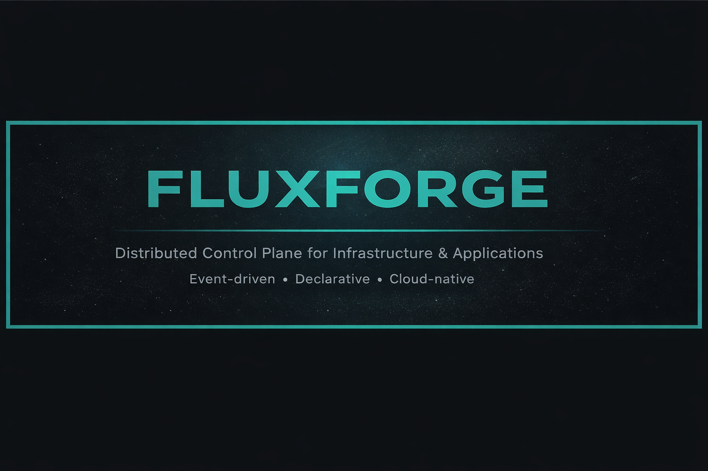

<p>
  
  
  
  
</p>



- **Documentation:** Coming soon  
- **Issues:** Open an issue (bug report, feature request, discussion)

_FluxForge is a distributed, event-driven control plane for infrastructure and application automation._

---

## About FluxForge

FluxForge is a cloud-native control plane designed to orchestrate infrastructure
and application operations across distributed environments.

It provides remote execution, desired-state enforcement, and automation
capabilities across cloud, on-prem, containerized, and hybrid systems.

FluxForge is designed to scale from single-node deployments to large distributed
fleets managed through a centralized control plane with decentralized execution.

---

## Features

- Distributed remote execution
- Event-driven automation
- Declarative desired-state management
- Secure agent-based architecture
- Modular execution system
- API-first design

---

## Architecture

FluxForge follows a control-plane and agent-based architecture.

```

User / API / UI
|
Control Plane
|
Event Bus
|
Agents
|
Infrastructure & Applications

```

---

## Core Components

### Control Plane
Responsible for orchestration, state management, scheduling, and event processing.

### Agents
Lightweight runtimes deployed on managed systems to execute tasks, enforce state,
and report system data back to the control plane.

### Event System
Provides real-time event delivery for execution triggers, state changes, and
automation workflows.

### Modules
Pluggable execution units extending FluxForge with system, application, and cloud
automation capabilities.

---

## Use Cases

- Infrastructure automation
- Configuration enforcement
- Event-driven remediation
- Application lifecycle management
- Hybrid and multi-cloud operations

---

## Project Layout

```

fluxforge/
├ control_plane/
├ agent/
├ modules/
├ workflows/
├ providers/
├ sdk/
├ docs/
├ tests/
└ tools/

````

---

## Getting Started

```bash
git clone https://github.com/itskum47/FluxForge.git
cd FluxForge
docker-compose up
````

---

## Project Status

FluxForge is under active development.
APIs and internal architecture may evolve.

---

## License
FluxForge is licensed under the Apache License, Version 2.0.

