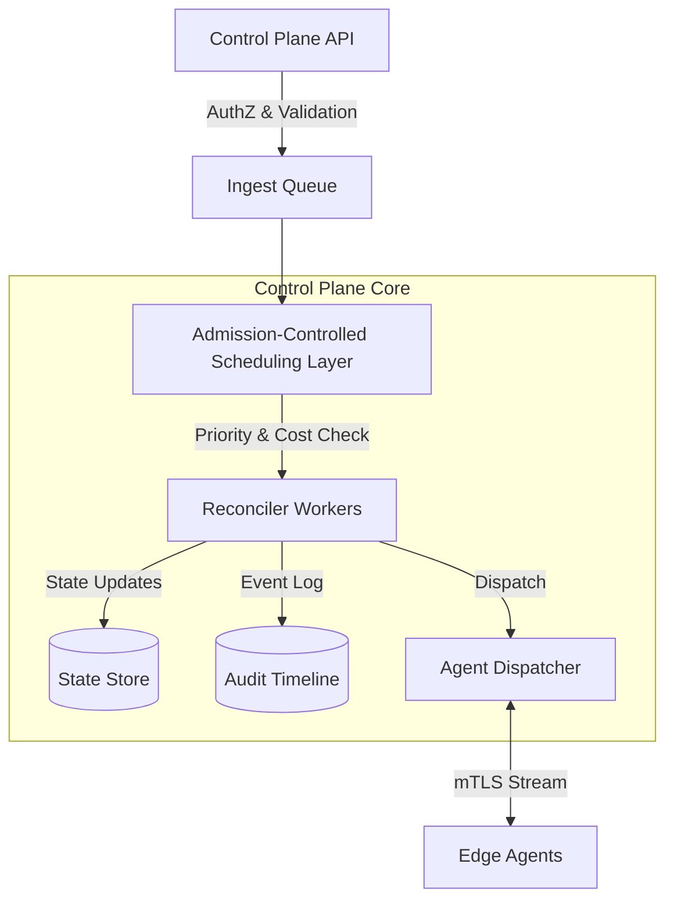

# FluxForge: Deterministic Control Plane for Distributed Systems

> **Status**: v0.4.0-production-hardened (Phase 4 Complete)
> **License**: MIT
> **Architecture**: Event-Driven, Admission-Controlled Scheduler

FluxForge is a high-performance, deterministic control plane for orchestrating distributed state across unreliable infrastructure. Unlike general-purpose CI/CD runners or strict GitOps operators, FluxForge focuses on **Intelligent Scheduling**, **Failure Domain Isolation**, and **Auditable Reconciliation**.

Designed for systems where:
- **Partial failure is the norm**, not the exception.
- **Agents are untrusted** and may report stale or malicious data.
- **Metrics lag reality**, requiring predictive scheduling.
- **Reconciliation must be fair**, cost-aware, and strictly bounded.

---

## 🏗 High-Level Architecture

FluxForge introduces an **Admission-Controlled Scheduling Layer** between the API and the Execution Workers to prevent the "thundering herd" problem common in naive control planes.

### Key Components

1.  **Ingest Queue (NATS/Kafka)**: Backpressure mechanism to protect the core.
2.  **Intelligent Scheduler**: 
    - **Priority Aging**: Prevents starvation of low-priority tasks.
    - **Cost-Awareness**: Rejects tasks if "CPU Budget" is exceeded.
    - **Failure Domain Isolation**: Throttles scheduling to zones/racks experiencing high failure rates.
3.  **Composite Health Engine**:
    - Calculates `HealthScore` = `0.2*AgentReport + 0.5*ObservedFailure + 0.3*ExternalProbe`.
    - Automatically quarantines nodes with degrading scores using an **Exponential Weighted Moving Average (EWMA)** decay.
4.  **Reconciliation Timeline**:
    - An append-only audit log of every state transition (`QUEUED` -> `DISPATCHED` -> `FINISHED`).
    - **Bounded Storage**: 24h TTL, Max 200 events per Request ID.

---

## 🧠 Reconciliation Model

FluxForge moves beyond "Applying changes" to a detailed lifecycle management model:

1.  **Check**: Compare `DesiredState` vs `ActualState` (non-zero exit code detection).
2.  **Drift Detection**: If mismatched, create a `ReconciliationTask`.
3.  **Admission**: Task enters the **Priority Queue**. 
    - *Is the tenant over quota?* (Hard Limit)
    - *Is the failure domain healthy?* (Soft Limit)
    - *Is the queue full?* (Self-Protection: Drop P10 tasks)
4.  **Execution**: 
    - Idempotency Check (`X-Flux-Idempotency-Key`): Returns cached success if already done.
    - Dispatch to Agent.
5.  **Verification**: Poll until `ActualState` matches or Deadline Exceeded.

---

## 🛡 Failure Handling Philosophy

We assume infrastructure is hostile.

1.  **Partial Failure is Normal**:
    - If "Zone-A" has high error rates, the Scheduler **automatically throttles** new tasks to that zone.
    - It does not stop globally; it creates a "blast radius containment".

2.  **Agents Lie**:
    - An agent saying "I am healthy" is ignored if it failed the last 5 jobs.
    - Source of Truth = **Observed Behavior** (Control Plane view), not Self-Reported State.

3.  **Retries Amplify Outages**:
    - FluxForge uses specific **Backoff Policies** (Linear, Exponential) per failure type.
    - **Poison Pattern Detection**: If a task crashes 3 different nodes, it is suspended to prevent taking down the fleet.

---

## 📊 Observability Model

"Why is it broken?" should be answerable in <60 seconds.

### Metrics (Prometheus)
- `flux_queue_depth`: Pending tasks (Leading indicator of overload).
- `flux_queue_oldest_task_age_seconds`: Starvation metric.
- `flux_scheduler_mode`: `NORMAL` | `DEGRADED` | `READ_ONLY`.
- `flux_domain_failure_rate`: Real-time health of your infrastructure zones.

### Debug Snapshots
`GET /scheduler/debug/snapshot` returns the internal heap state, failure counters, and active quarantines.

---

## ⚡ Comparison: Why not Flux/Argo?

| Feature | FluxForge | GitOps Operators (ArgoCD/Flux) |
| :--- | :--- | :--- |
| **Primary Goal** | Distributed Orchestration & Resilience | K8s Manifest Sync |
| **Scheduling** | **Priority + Cost + Fairness** | FIFO / Event Loop |
| **Failure Handling** | **Domain Isolation & Quarantine** | Retry until crashloop |
| **Target** | Remote Agents (IoT, Edge, VM) | Kubernetes Clusters |
| **State** | Imperative + Declarative | Purely Declarative |
| **Latency** | Real-time (<50ms Dispatch) | Minutes (Reconcile Interval) |

Use **FluxForge** when you need to control *execution behavior*, not just *configuration state*.

---

## 🚀 Releases

- **v0.4.0** (Current): Production Hardening (Scheduler Modes, Tenant Isolation, Observability).
- **v0.3.0**: Distributed Execution (Dispatcher, Agents).
- **v0.2.0**: Desired State Engine.
- **v0.1.0**: Core Control Plane types.

## 📚 Documentation

Detailed architecture and operational guides:

- [Architecture Overview](docs/architecture/overview.md)
- [Scheduler Design](docs/architecture/scheduler-design.md)
- [Failure Scenarios](docs/operations/failure-scenarios.md)
- [Operations Runbook](docs/operations/runbook.md)

---

## 🔮 Roadmap

- **Phase 5 (Persistence)**: Replace in-memory stores with Postgres/Redis. Leader Election.
- **Phase 6 (Security)**: Full mTLS enforcement, OPA integration.
- **Phase 7 (Scale)**: Horizontal sharding, 10k node simulation.
