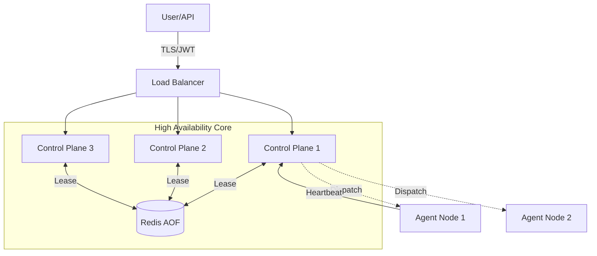

<div align="center">

# FluxForge
### The Atomic Control Plane for Distributed Systems

[](https://goreportcard.com/report/github.com/itskum47/FluxForge)
[](https://opensource.org/licenses/MIT)
[]()
[](https://github.com/itskum47/FluxForge/tree/main/scripts)
[]()

*Orchestrate Reliability. Defy Chaos.*

[Features](#-features) • [Architecture](#-architecture) • [Quick Start](#-quick-start) • [Chaos Engineering](#-chaos-testing)

</div>

---

## ⚡ What is FluxForge?

FluxForge is a **production-verified distributed control plane** engineered for absolute reliability. It isn't just a task runner; it's a self-healing brain for your infrastructure.

Built to survive the most hostile environments, FluxForge combines **atomic persistence**, **leader election**, and **active reconciliation** to guarantee that your desired state *becomes* the actual state—no matter what breaks in between.

> "FluxForge doesn't just manage jobs; it actively fights entropy."

## 🚀 Features

*   **🛡️ Battle-Hardened Core**: Certified against network partitions, node kills, and process crashes.
*   **🧠 Distributed Intelligence**: Automatic, lease-based leader election with aggressive fencing to prevent split-brains.
*   **⚛️ Atomic Perfection**: All state transitions use strictly versioned, atomic compare-and-swap operations. No lost updates. Ever.
*   **🔐 Zero-Trust Security**: Multi-tenant isolation by design. Every request is authenticated via JWT and encrypted via TLS 1.2+.
*   **📡 Real-Time Observability**: Deep visibility with Prometheus metrics for everything from queue depth to leader epochs.
*   **🌪️ Chaos Native**: Resilience is not an afterthought. It's built-in and verified with an integrated Chaos Monkey.

## 🏗️ Architecture

FluxForge operates on a strict **Controller-Agent** model, backed by a high-availability persistence layer.



*   **Control Plane**: Stateless, horizontally scalable nodes. One leader rules them all.
*   **Persistence**: AOF-enabled Redis ensures durability.
*   **agents**: Lightweight, autonomous execution units that survive control plane outages.

## 🏁 Quick Start

Spin up a full production-like cluster locally in seconds.

### Prerequisites
*   Docker & Docker Compose
*   `curl` & `openssl`

### 1. Ignite the Cluster
```bash
git clone https://github.com/itskum47/FluxForge.git
cd FluxForge
docker compose up -d --build
```

### 2. Verify Vital Signs
Check if the cluster has elected a leader and is actively reporting metrics.
```bash
# This should return '1' indicating a healthy leader exists
curl -k https://localhost:8443/metrics | grep flux_leader_status
```

### 3. Unleash an Agent
Obtain a secure token and command your fleet.
```bash
TOKEN=$(./scripts/generate_token.sh default)

curl -k -X POST https://localhost:8443/jobs \
  -H "Authorization: Bearer $TOKEN" \
  -H "Content-Type: application/json" \
  -d '{"command":"echo Hello FluxForge","node_id":"agent-1"}'
```

## 🌪️ Chaos Testing

FluxForge is **Chaos Certified**. We don't just hope it works; we prove it.

Our forensic audit verifies resilience against:
*   ❌ **Leader Assassination**: Leaders are killed randomly; failover occurs in <15s.
*   ✂️ **Network Severing**: Partitions are simulated; data consistency is maintained.
*   💀 **Agent blackouts**: Dead agents are detected and fenced strictly.

Run the Chaos Monkey yourself (if you dare):
```bash
./scripts/phase7_chaos_monkey.sh 5 10
# Runs a 5-minute chaos session with 10 fault injections
```

## 📊 Production Status

| Module | Status | Verdict |
|:---|:---:|:---|
| **Agent Lifecycle** | 🟢 | **PASS** |
| **Atomic Persistence** | 🟢 | **PASS** |
| **High Availability** | 🟢 | **PASS** |
| **Multi-Tenancy** | 🟢 | **PASS** |
| **Security (TLS/JWT)** | 🟢 | **PASS** |

## 🛠️ Stack

*   **Core**: Go 1.24
*   **State**: Redis 7 (AOF)
*   **Ingress**: Nginx (TLS)
*   **Metrics**: Prometheus

## 📜 License

MIT © [Kumar Mangalam](https://github.com/itskum47)
